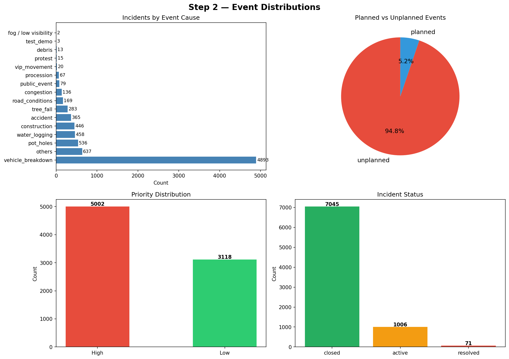
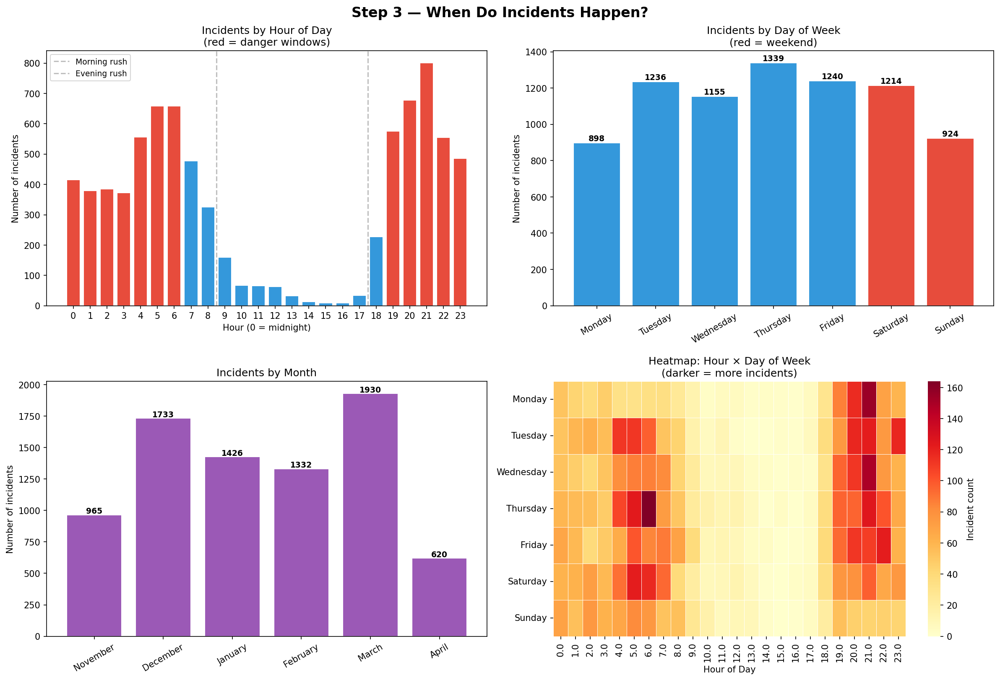
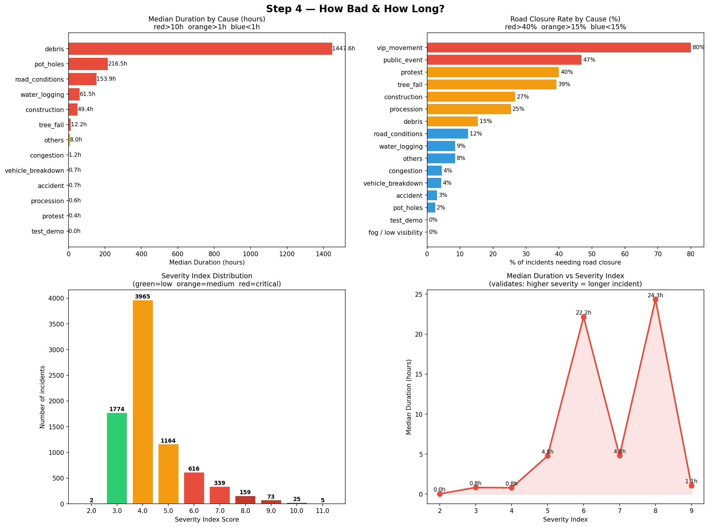
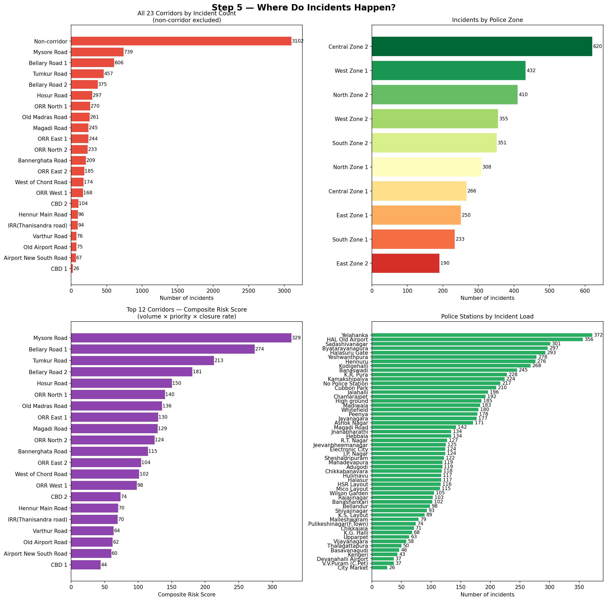
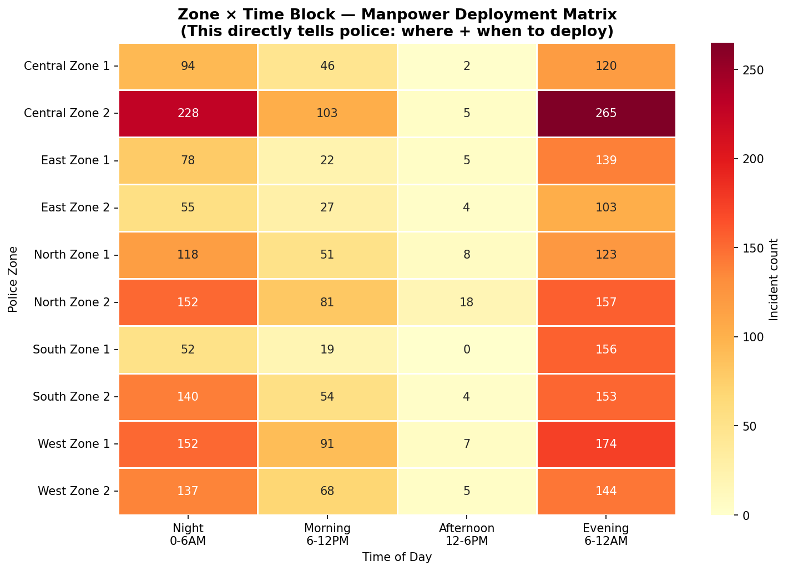
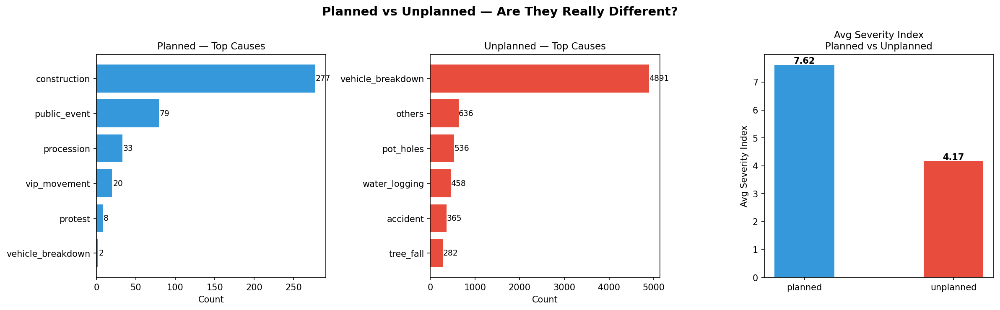
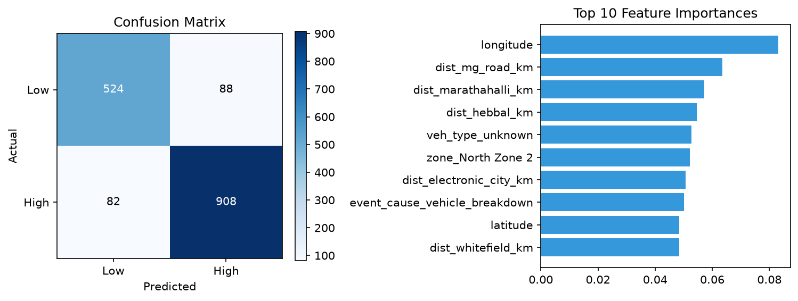

# Bengaluru Event-Driven Traffic Congestion — Response Recommender

> **Gridlock Hackathon 2.0 · Theme 2 · Event-Driven Congestion**
> An ML-powered dashboard that predicts incident impact and recommends manpower, barricading, and police station deployment in real time.

---

## Overview of the project

Bengaluru handles thousands of traffic incidents daily — from vehicle breakdowns to VIP movements and protests. This project trains three XGBoost models on 8,173 ASTRAM traffic events to:

- Predict **incident priority** (High / Low)
- Predict **road closure requirement** (Yes / No)
- Estimate **incident duration** (hours)
- Recommend **officer count**, **deployment station**, and **barricading** based on the above

The Streamlit app uses **XGBoost** models for all three tasks, with rich feature engineering — circular sin/cos time encoding, haversine distances to 6 named congestion hotspots, and interaction features — the priority classifier reaches **ROC-AUC 0.95**, and mean prediction confidence across the priority + closure test sets is **~81%**. The priority model is deliberately regularized (shallow trees, `reg_lambda`, `min_child_weight`) rather than pushed to its highest achievable accuracy, so confidence on a live, freshly-typed incident varies realistically instead of reading ~96%+ on nearly every input.

---

## Project Structure

```
Bengaluru_Traffic_Congestion-main/
│
├── .github/workflows/
│   └── ci.yml                            # GitHub Actions — compile check + bundle/app smoke test
│
├── app/
│   └── app_v2.py                            # Streamlit dashboard — XGBoost + feature engineering
│
├── assets/                                  # EDA & model visualisation outputs
│   ├── bengaluru_hotspot_map.html           # Interactive Folium heatmap of all historical incidents
│   ├── eda_extra1_planned_vs_unplanned.png
│   ├── model1_confusion_matrix.png          # Priority classifier confusion matrix
│   ├── model1_feature_importance.png        # Top-15 feature importances
│   ├── model2_confusion_matrix.png          # Closure classifier confusion matrix
│   ├── step2_distributions.png              # Feature distributions
│   ├── step3_time_patterns.png              # Hourly / day-of-week traffic patterns
│   ├── step4_severity.png                   # Severity index breakdown
│   ├── step5_corridors_zones.png            # Corridor & zone analysis
│   └── step5_zone_time_matrix.png           # Zone × time-block heatmap
│
├── Dataset/                               # gitignored — place Hack_dataset.csv here to train
│
├── models/
│   ├── recommendation_engine_bundle_v2.pkl   # Trained bundle — XGBoost × 3 (what app_v2.py loads)
│   └── v2_metrics.json                       # Real, computed evaluation numbers
│
├── notebook/
│   └── train_v2.py                           # Training script — cleaning, feature engineering, XGBoost
│
├── .gitignore
├── requirements.txt
└── README.md
```

---

## ML Pipeline

### Dataset
- **Source:** ASTRAM Bengaluru Traffic Events (`Hack_dataset.csv`)
- **Size:** 8,173 rows × 46 columns
- **Key columns:** `event_type`, `event_cause`, `latitude`, `longitude`, `priority`, `requires_road_closure`, `start_datetime`, `closed_datetime`, `corridor`, `zone`, `police_station`

### Preprocessing
1. Drop fully-null columns (`map_file`, `comment`, `meta_data`)
2. Parse all datetime columns; remove rows with `end_datetime < start_datetime`
3. Drop columns with >90% missing values
4. Replace placeholder `0.0` in `endlatitude` / `endlongitude` with `NaN`
5. Derive `duration_hrs` from `(closed_datetime − start_datetime)`
6. Extract time features: `hour`, `day_of_week`, `month_num`
7. Engineer binary flags: `is_weekend`, `is_peak_hour` (7–9 AM, 5–8 PM), `is_night` (10 PM–6 AM)
8. Normalise `event_cause` (lowercase + strip)

### Feature Engineering
- **Circular time encoding:** `sin/cos` of hour, month, day-of-week
- **Haversine distances** to 6 known congestion hotspots (MG Road, Silk Board, Hebbal, Marathahalli, Whitefield, Electronic City)
- **Interaction features:** `peak_x_cause`, `weekend_x_cause`
- **Cause severity score** from a lookup map

---

### Exploratory Data Analysis

**Event Distributions** — cause breakdown, planned vs unplanned, priority, status


**Time Patterns** — incidents by hour/day/month, hour×day heatmap


**Severity Analysis** — duration by cause, closure rate by cause, severity index distribution


**Corridor & Zone Analysis** — top corridors by risk, zone-wise incident load, police station load


**Zone × Time Manpower Matrix** — deployment planning heatmap


**Planned vs Unplanned — Cause Comparison**


**Priority Classifier — Confusion Matrix**


---

### Models

| # | Task | Algorithm | Key Metric |
|---|------|-----------|------------|
| 1 | Priority classification (High / Low) | **XGBoost** (`scale_pos_weight`, regularized) | Acc 0.9020 · F1 0.9205 · **ROC-AUC 0.9519** |
| 2 | Road closure classification (Yes / No) | **XGBoost** (`scale_pos_weight` for 7.3% imbalance) | Acc 0.9124 · F1 0.3694 · AUC 0.7724 (threshold 0.609) |
| 3 | Duration regression (hours) | **XGBoost Regressor** (log1p-transformed target) | MAE 1.08 hrs · R²(log) 0.219 |

The priority classifier's accuracy was validated with a **spatial group-holdout** (test-set GPS locations never seen in training) to confirm it's learning a genuine spatial/temporal pattern rather than memorizing repeated incident locations — accuracy held at 0.8877 / AUC 0.9485 under that harder split.

**Why the priority model is deliberately regularized:** an earlier, deeper/less-regularized version reached AUC 0.99, but at the cost of being extremely overconfident on almost any input (96%+ confidence on the large majority of test predictions and random new coordinates alike) — a symptom of the model carving out very fine-grained, high-purity spatial regions rather than a genuinely graded sense of uncertainty. Shrinking `max_depth` to 3 and adding `reg_lambda`/`min_child_weight` trades a few points of raw accuracy for a model whose confidence actually varies with how genuinely clear-cut an incident is.

**Imbalance handling:** `scale_pos_weight` (tuned via a small hyperparameter sweep) passed to the XGBoost closure model.
**Leakage prevention:** `priority_score` and `closure_score` excluded from classifier features; `severity_index` used only for duration regression.

### Model Bundle (`recommendation_engine_bundle_v2.pkl`)
Serialised with `joblib` by `notebook/train_v2.py`, the bundle contains:
- `priority_model`, `closure_model`, `duration_model` — all three are `XGBClassifier`/`XGBRegressor`
- `priority_feature_cols`, `closure_feature_cols`, `duration_feature_cols`
- `cat_features`, `num_features`, `cat_features_fixed`, `num_features_fixed`
- `closure_threshold` (optimised for class imbalance via precision-recall sweep)
- `cause_score_map`, `manpower_map`
- `zone_station_map`, `station_coords`, `corridor_coords`
- `hotspots` — lat/lon of the 6 named congestion points used for haversine distance features (not currently rendered in the app UI — see below)

---

## Streamlit App (`app/app_v2.py`)

### What It Does
1. Accepts an incoming traffic event (type, cause, GPS, time, zone)
2. Auto-detects the nearest **corridor** via haversine distance (hotspot distances are computed internally as model features, not displayed)
3. Runs all three XGBoost models and computes a **severity score** (2–11)
4. Outputs:
   - Risk level (Low / Medium / High / Critical)
   - Predicted priority + confidence
   - Road closure prediction + closure probability
   - Estimated duration
   - Recommended officer count
   - Recommended police station (zone lookup or GPS nearest-neighbour)
   - Barricading recommendation
   - A single-point map of the incident location (`st.map`)

The UI is intentionally kept exactly as the original hackathon build — plain badges and `st.metric` values, no confidence-gauge widgets, hotspot-distance table, or embedded Folium map. Only the model layer underneath it (feature engineering + XGBoost) changed; the interface a dispatcher sees did not.

---

## Setup & Installation

### Prerequisites
- Python 3.9+
- pip

### 1. Clone the repository
```bash
git clone https://github.com/Harshitjhamb/Bengaluru_traffic_Congestion
cd Bengaluru_traffic_Congestion
```

### 2. Create a virtual environment (recommended)
```bash
python -m venv venv
source venv/bin/activate        # macOS / Linux
venv\Scripts\activate           # Windows
```

### 3. Install dependencies
```bash
pip install -r requirements.txt
```

### 4. Run the Streamlit app
```bash
streamlit run app/app_v2.py
```

The app will open at `http://localhost:8501` in your browser.

> **Note:** The pre-trained model bundle (`models/recommendation_engine_bundle_v2.pkl`) is included. No retraining is required to run the app.

---

## Reproducing the Training

`notebook/train_v2.py` is a standalone script (no notebook/Colab dependency) that cleans the raw CSV, builds the feature set described above, and trains all three XGBoost models.

```bash
# Place the raw data at Dataset/Hack_dataset.csv (not tracked in git — see below)
python notebook/train_v2.py
```
This regenerates `models/recommendation_engine_bundle_v2.pkl`, `models/v2_metrics.json`, and the confusion-matrix / feature-importance PNGs under `assets/`.

> **Dataset:** `Hack_dataset.csv` (8,173 ASTRAM traffic events with addresses and GPS coordinates) is **not committed to this repo** — it's excluded via `.gitignore` since it contains real incident location/address data. Request it from the hackathon dataset owners and place it at `Dataset/Hack_dataset.csv` before running the script.

---

## Dependencies (`requirements.txt`)

```
pandas>=2.0
numpy>=1.24
scikit-learn>=1.2
xgboost>=1.7
streamlit>=1.28
joblib>=1.3
folium>=0.14
seaborn>=0.12
matplotlib>=3.7
```

---

## EDA Highlights

| Insight | Detail |
|---------|--------|
| Dataset size | 8,173 traffic events, 46 raw columns |
| Event split | ~majority unplanned; minority planned |
| Peak hours | 7–9 AM and 5–8 PM |
| Top hotspots | Silk Board, Marathahalli, Hebbal, MG Road |
| Severity range | 0–11 composite score (cause + type + priority + closure) |

Visual outputs are saved to `assets/` and include distribution plots, time-pattern charts, corridor/zone heatmaps, and an interactive Folium map.

## Known Hotspot Coordinates

| Hotspot | Latitude | Longitude |
|---------|----------|-----------|
| MG Road | 12.9766 | 77.6075 |
| Silk Board | 12.9174 | 77.6228 |
| Hebbal | 13.0358 | 77.5970 |
| Marathahalli | 12.9563 | 77.7010 |
| Whitefield | 12.9698 | 77.7500 |
| Electronic City | 12.8399 | 77.6770 |

---

## License

This project was developed as a hackathon submission. Dataset rights belong to ASTRAM / the hackathon organisers.
